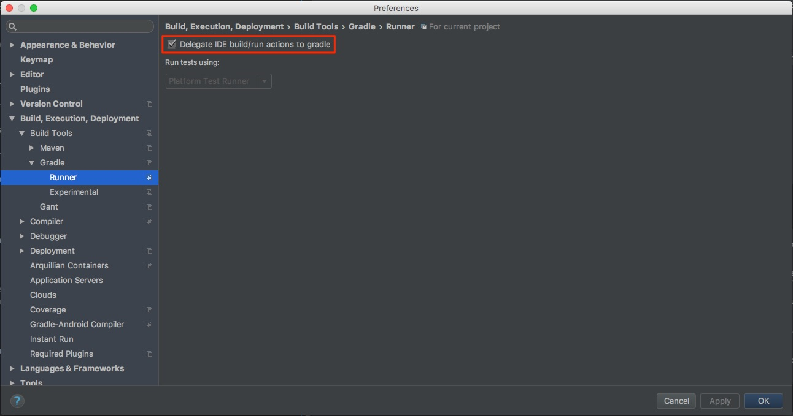
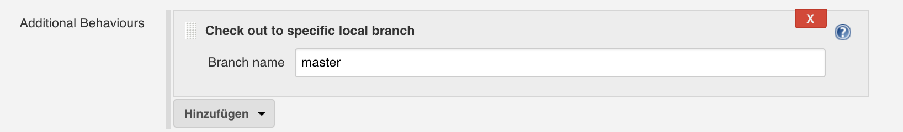

<a href="https://www.karriere.at/" target="_blank"></a>
<span>&nbsp;&nbsp;&nbsp;</span>
[](https://travis-ci.org/karriereat/gradle-version-plugin)

# Gradle Version Plugin

* [Introduction](#introduction)
* [Usage](#usage)
* [Version properties](#version-properties)
	* [Version](#version)
	* [Version.Upgrade](#versionupgrade)
	* [Version.Snapshot](#versionsnapshot)
* [Tasks](#tasks)
	* [SetVersion](#setversion)
	* [IncreaseVersion](#increaseversion)
* [Suggested workflow](#suggested-workflow)
* [Delegate IDE build tasks to Gradle](#delegate-ide-build-tasks-to-gradle)
* [Correctly configure Jenkins](#correctly-configure-jenkins)

## Introduction
The karriere.at Version Plugin automatically increases the version of a project. It assumes that [semantic versioning](http://semver.org/) is used and therefore the version number consists of three parts: (1) a major version number, (2) a minor version number and (3) a patch version number. 

It also assumes that you use git for your project as the version control system. 

The user that executes the plugin (no matter whether its a human or a CI Server such as Jenkins) also has to have the rights to commit to the git repository. 

As said before the plugin automatically increases the version of a project. It can detect if you are on a feature or a bugfix branch and will adapt its strategy to increase the version acordingly. The default strategy is to increase the minor version number. Every time the version was increased, the plugin resets the strategy to the default one.

To be able to automatically increase the version number all necessary information are stored in a `version.properties` file.

## Usage
Build script snippet for use in all Gradle versions:

```groovy
buildscript {
  repositories {
    maven {
      url "https://plugins.gradle.org/m2/"
    }
  }
  dependencies {
    classpath "gradle.plugin.at.karriere.gradle.plugins:karriere-version:<version>"
  }
}

apply plugin: "at.karriere.version"
```

Build script snippet for new, incubating, plugin mechanism introduced in Gradle 2.1:

```groovy
plugins {
  id "at.karriere.version" version "<version>"
}
```

Check the [Gradle Plugin Portal](https://plugins.gradle.org/plugin/at.karriere.version) for the most up-to-date version.

## Version properties
To store all necessary information for the automatic version handling a file called `version.properties` is created. The file can either be created manually or it will be created automatically by the plugin when it runs the first time.

No matter how the file is created it has to have the following structure:

```properties
version=1.0.0                    # mandatory
version.upgrade=minor            # mandatory
version.snapshot=branch-SNAPSHOT # optional
```

### Version
As the comment in the example file above already tells you is the `version` property mandatory. It contains the latest version of the project and should not be edited manually.

### Version.Upgrade
The `version.upgrade` property is also mandatory and defines the strategy what part of the version number should be increased. The default value is `minor` which tells the plugin to increase the minor version number. When instead `patch` or `major` is defined, the other parts of the version is increased accordingly. 

After a part of the version was increased, everthing after that part is reset to `0`. This means when my current version is `1.3.4` and my strategy is major the next version will be `2.0.0`.
  
If you work on a `bugfix` branch (the plugin can recognize this automatically if the name of the branch starts with `bugfix`), the strategy is changed to `patch` automatically when your project is compiled using gradle.

When you know you need to increase the `major` version number you have to declare that yourself in the `version.properties` file.

After the version was increased the default strategy is restored again.

### Version.Snapshot
The `version.snapshot` property holds the version of the current snapshot branch. Also this property is optional and is only set on branches that are not the "master" branch. 

By default the snapshot version consists of the branch name (when you prefix your branches and separate the prefix and the name using a `/` the prefix will be removed) and a `-SNAPSHOT` suffix. However you can set the snapshot version yourself, too. 

If this property is set, this version is used to set the project version during a build.

Similar to the `patch` upgrade strategy also the snapshot version is set automatically when your project is compiled using gradle.


## Tasks
All tasks provided by this plugin are grouped in the `versioning` group.

### SetVersion
Without this plugin you would have to do this by your self by declaring `version=<currentProjectVersion>` in your build.gradle script. The `setVersion` tasks does the same by reading the current version from the `version.properties` file and setting it in the gradle project object. Make sure that you remove declaration of the version in the build.gradle file, when you use this plugin!

The `setVersion` task always runs before the `classes` task if this task exists. If that task doesn't exist because you don't use the `java` plugin (or any other plugin that creates a `classes` task) you have to include the `setVersion` task in the gradle build lifecycle yourself. You can do this using the following code:

```groovy
setVersion.finalizedBy [theTaskThatShouldRunAfterSetVersion]
```

More information about gradle task dependencies can be found in the [gradle docs](https://docs.gradle.org/current/userguide/tutorial_using_tasks.html#sec:task_dependencies).

### IncreaseVersion
The `increaseVersion` task is used to increase the version of the project. It reads the configuration stored in the `version.properties` file and modifies the version accordingly. The new version is then written again to the `version.properties` file and committed and pushed to the repository again.

## Suggested workflow
It is a good idea to use a CI Server to build your artifacts. In order to automatically increase the version of your project, you should create two tasks: (1) one to increase the version and (2) one to build the artifact. 

To increment the version number the first task should execute `./gradlew increaseVersion`. This will increment the version number according to the `version.upgrade` property and commit the changed file back to the git repository.

The second task should then build the artifact using something like `./gradlew clean build`. To avoid lots of manual steps it can be triggered automatically after the first tasks has completed successfully. 

Why do you need two tasks?

The reason why you need two tasks is gradles execution lifecycle. As you might know gradle has [three build phases](https://docs.gradle.org/current/userguide/build_lifecycle.html#sec:build_phases). During the first phase the projects gets initialized, in the second phase the tasks get configured and in the third phase all tasks are executed.

Some tasks (such as the jar or the mave-publish task) need the new version number in the _configuration_ phase but we can only increase it in the _execution_ phase since we only know in the execution phase whether the `increaseVersion` tasks should be executed or not (all tasks always run through the configuration phase).

This means that we need the incremented version number before we can increment it. Therefore you need to separate these two steps.

## Delegate IDE build tasks to gradle
Since the plugin handles the version of your project the IDE should invoke gradle tasks to build the project. For IntelliJ you can do this by opening the `Preferences` and then active the `Delegate IDE build/run actions to gradle` in the `Build, Execution, Deployment` > `Build Tools` > `Gradle` > `Runner` submenu.
 


## Correctly configure Jenkins
The Jenkins git plugin has a special feature to check out a specific commit instead of a specific branch. This makes Jenkins always work on a detached HEAD instead of, lets say, the master branch. To correctly set the version our plugin needs to know when a release version (i.e. the project is built on the master branch) and when a snapshot version is built.

In order to make the plugin work together with Jenkins you have to configure the git plugin so that it always creates a local branch called 'master' to build your release artifacts.

To do this open the configuration page of your Jenkins task and scroll down to the Source-Code-Management section. There you can add an 'Additional Behaviour' called 'Check out to specific local branch'. This provides you a textbox where you can enter the name of the local branch. In our usecase this has to be 'master'. 

